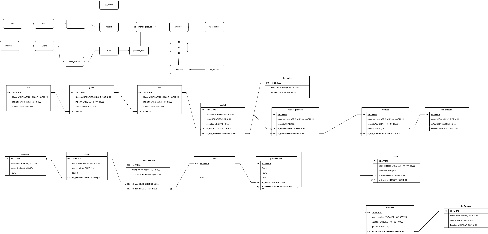

**ENUNȚ PROIECT**

Există o rețea de supermarket-uri care dorește să își noteze locațiile și ulterior să se extindă  în zonele neacoperite conform planurilor de management. Odată cu maparea supermarket-urilor existente se dorește și implementarea unui sistem de urmărire a vânzărilor, a stocurilor existente, dar și a necesarului de aprovizionare și comunicare directă cu furnizorii.

Entitați:
-	Țară, județ, UAT
-	Market, tip_market
-	Vânzări, clienți, date_client
-	Stoc, produse
-	Furnizori, date_furnizori

